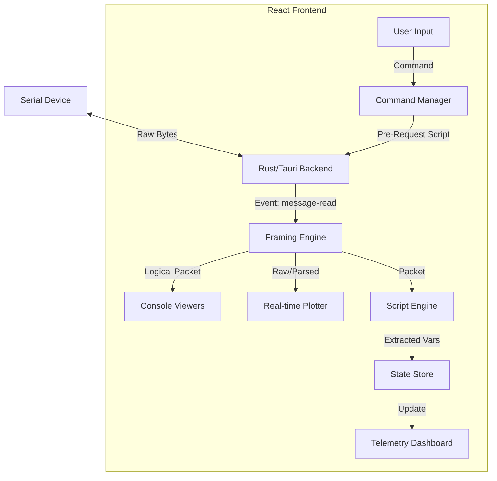

# Serial Port API Manager (`serialport-api-mgr`)


**Serial Port API Manager** is a modern, high-performance desktop application for engineers and developers working with serial communication. It combines the raw power of a terminal with the intelligence of low-code automation and real-time visualization.

Whether you are debugging a microcontroller, reverse-engineering a protocol, or building a permanent HMI for an industrial device, this tool adapts to your workflow.

---

## 🌟 Key Features

### 🔌 Connectivity & Core
*   **Multi-Session Support:** Manage multiple serial connections simultaneously in tabs.
*   **Flexible Config:** Full control over Baud Rate, Data/Stop Bits, Parity, and Flow Control.
*   **Network Support:** Connect to TCP/UDP endpoints as if they were serial ports.
*   **Mock Mode:** Built-in mock ports (Echo, Sine Wave, JSON Stream) for testing without hardware.

### 📊 Visualization & Analysis
*   **Multi-View Console:**
    *   **List View:** Chat-style bubble interface with timestamping.
    *   **Hex View:** Professional hex dump inspector.
    *   **Stream View:** Split TX/RX streams for full-duplex debugging.
    *   **Logic Analyzer:** Visual representation of signal timing (simulated).
*   **Real-time Plotter (Oscilloscope):**
    *   **Zero-Config:** Automatically detects CSV or JSON numeric streams.
    *   **Interactive:** Zoom and pan with touch pad gestures.
    *   **Auto-Scroll:** "Follow" mode keeps the latest data in view.
    *   **Multi-Channel:** Supports up to 20 simultaneous series.
*   **Telemetry Dashboard (HMI):**
    *   Create custom control panels with **Gauges**, **Charts**, and **Value Cards**.
    *   Link widgets to variables extracted via the scripting engine.

### ⚡ Automation & Intelligence
*   **Scripting Engine:**
    *   **Pre-Request:** Modify payloads dynamically using JavaScript before sending.
    *   **Post-Response:** Parse incoming data, extract variables, and trigger logic.
*   **Command Management:** Save frequently used commands with typed parameters (String, Int, Enum, Boolean).
*   **Sequence Builder:** Chain commands into complex workflows with delays and error handling.
*   **AI Assistant:** Generate commands, sequences, and parsing scripts from natural language descriptions (powered by Google Gemini).

### 📦 Protocol Handling
*   **Smart Framing:** Split raw data streams into logical packets using:
    *   **Delimiter:** (e.g., `\n`, `0x03`)
    *   **Timeout:** (Idle time detection)
    *   **Prefix Length:** (Length-prefixed binary protocols)
    *   **Custom Script:** (Write your own frame detector in JS)
*   **Modbus & AT Wizards:** Built-in generators for common industrial protocols.

---

## 🏗️ Architecture & Data Flow

This diagram illustrates how data flows from the hardware to the various visualization and automation layers.



---

## 🚀 Getting Started

### Prerequisites
*   **Node.js** (v22+ recommended)
*   **pnpm** (v10.27.0 - **Mandatory**)
*   **Rust** (Latest stable)

### Installation

1.  **Clone the repository:**
    ```bash
    git clone https://github.com/yourusername/serialport-api-mgr.git
    cd serialport-api-mgr
    ```

2.  **Install dependencies:**
    ```bash
    pnpm install
    ```

3.  **Run in Development Mode:**
    ```bash
    # Starts both React frontend and Tauri backend
    pnpm tauri dev
    ```

### Building for Production
```bash
pnpm tauri build
```

---

## 📖 Usage Guide

### 1. Connection
*   Open the application.
*   In the top bar, select your **Connection Type** (Serial or Network).
*   Click the **Connector Icon** (Plug) to select a port.
    *   *Tip:* Select `mock-sine-wave` to test the Plotter without hardware.
*   Configure baud rate and other settings in the sidebar or via the "Settings" button.

### 2. using the Real-time Plotter
The Plotter is designed for immediate insight into raw data streams.
1.  Switch to the **Plotter** view using the chart icon in the view toggle bar.
2.  **Enable** the plotter using the button in the header.
3.  **Data Formats:**
    *   **CSV:** Send `10, 20, 30\n`. Plots 3 series.
    *   **JSON:** Send `{"temp": 25, "hum": 60}\n`. Plots "temp" and "hum".
    *   **Regex:** Configure a custom regex in settings (e.g., `v=(\d+)`) to extract values from complex strings.
4.  **Navigation:**
    *   **Follow Mode:** Click "Follow" to auto-scroll with new data.
    *   **Zoom:** Use **Ctrl + Scroll/Pinch** on the chart area.
    *   **Pan:** Use **Two-finger swipe** or **Shift + Scroll**.
    *   *Note:* Interacting with the chart automatically pauses "Follow" mode.

### 3. Scripting & Dashboard
To build a permanent HMI:
1.  **Define a Command:** Create a command (e.g., "Read Sensors").
2.  **Add Post-Response Script:**
    ```javascript
    // Example: Parse "T:25.5 H:60"
    const temp = parseFloat(data.match(/T:([\d.]+)/)[1]);
    const hum = parseFloat(data.match(/H:([\d.]+)/)[1]);
    
    // Save to global variables
    setVar('temperature', temp);
    setVar('humidity', hum);
    return true; // Mark command as successful
    ```
3.  **Go to Dashboard:** Switch to the Dashboard view.
4.  **Add Widget:** Click "Add Widget", select "temperature", and choose a visualization (Gauge, Line Chart, or Card).

### 4. AI Assistant
*   Click the **AI Assistant** icon in the sidebar.
*   Type a request: *"Create a command sequence to initialize a SIM800L module and send an SMS."*
*   The AI will generate the commands and sequences for you to import directly into your project.
*   *Note:* Requires `GEMINI_API_KEY` environment variable.

---

## 🛠️ Development & Contributing

### Directory Structure
*   `src/components/`: React UI components.
*   `src/lib/`: Core logic (Framing, Scripting, Store).
*   `src/lib/slices/`: Zustand state slices.
*   `src-tauri/src/`: Rust backend code.

### Quality Assurance
Before submitting a PR, ensure high code quality:
*   **Linting:** `pnpm run lint` (ESLint)
*   **Type Checking:** `pnpm run type-check` (TypeScript)
*   **Formatting:** `pnpm run format` (Prettier)

### Mocking
When implementing new hardware features, always update `src/lib/mockPort.ts` to include a simulation. This ensures features can be tested by other developers without specific hardware.

---

*Built with ❤️ for the embedded systems community.*